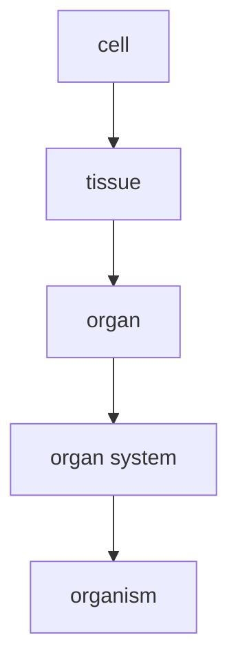

### Terms

* movement
* respiration
* sensitivity
* growth
* reproduction
* excretion
* nutrition

> glucose + oxygen = water + carbon dioxide + energy

### Movement

An action by an organism or part of an organism causing change of position or place.

### Sensitivity

Detect and respond to changes in the internal or external environment / stimuli.

### Growth

A permanent increase in size and dry mass.

### Reproduction

Make more of the same kind of organism

* sexual reproduction
* asexual reproduction

### Excretion (!= egestion)

Removal of waste products of metabolism and substances in excess of requirements from body.

### Nutrition

Taking in materials for energy, growth & development.

E.g. eating / ingestion, photosynthesis

### Animal cells and plant cells

* Nucleus
* Cytoplasm 
* Cell wall (rigid)
* mitochondrion
* Cell membrane
* Large vacuole 
#### Cell membrane (partially permeable)

* Forms a barrier
* Keeps contents inside
* Controls what goes in & out

#### Cytoplasm

* 70% water, jelly-like
* Containing many organelles and proteins
* Metabolic reactions take place in the cytoplasm 
#### Nucleus

* Store DNA / genetic information
* DNA forms chromosomes
* Controls the activities in a cell
* Controls how cells grow and develop

#### Mitochondrion 

> C6H12O6 + 6O2 &rarr; 6CO2 + 6H2O
* Aerobic respiration to provide energy
* Cells that use a lot of energy have a lot of mitochondria 

#### Ribosome

* Protein synthesis, where protein is made of amino acid
* Joining amino acids into a long chain
* In cytoplasm or attached to rough endoplasmic reticulum
* In all types of cells (including bacteria)

#### Vesicles

* Small fluid-filled space surrounded by membrane in animal cells
* Transport proteins out of the cell (e.g. antibody)
* Vacuole 
	* Vesicles (animal) transport protein
	* Large vacuole (plants)
		* store
		* Keep shape of the cell

#### Cell wall (rigid)

* Outside of cell membrane
* Made of cellulose
* Fully permeable
* Protect & support, stop cell from bursting

#### Chloroplast

* Contains pigment—chlorophyll
* Absorbs energy from sunlight, photosynthesis
* Contains starch chain

#### Vacuoles

* Plant cells have large vacuoles
* Contain cell sap
	* A solution of sugar and other substances
	* Keep the cell in shape

### Bacteria

* flagellum
* pilus
* Capsule &#8658; plasmid

> Virus is *NOT* living organism according to IGCSE syllabus

### From cell to organism

Organ system: A group of organs that work together to perform one or more functions 

Electron microscope: magnification &times; 10 million

Magnification = size of image / real size
