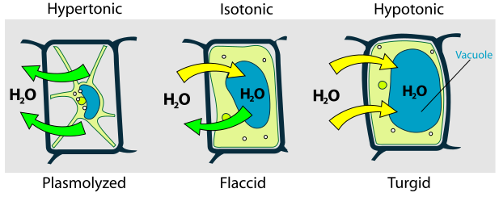

### Diffusion

* Net movement of molecules and ions
* From higher concentration to lower concentration
* As a result of the random movement of particles

#### How to make diffusion faster?

* Temperature increases
* Surface area of diffusion increases
* Concentration gradient increases
* Thickness of the diffusion surface decreases

### Osmosis

* The net movement of water molecules
* From regions with higher water potential to regions with lower water potential
* Through a partially permeable membrane
* Pure water &#8658; higher water potential
* Solution with the same concentration &#8658; same water potential
* Concentrated solution &#8658; lower water potential

#### Osmosis in plant cells

##### The uptake of minerals by root hair cells

Mineral ions are absorbed by *active transport*.

Active transport is a process that is against the concentration gradient and uses energy from respiration.

E.g. nitrate ion enters the carrier protein in cell membrane.

Carrier protein changes shape, pushing ions through the membrane into the cell.

Nitrate ions decrease the water potential within the cell; water is then absorbed by osmosis.

> Root hair cells have
> Large surface area
> A lot of mitochondria
> It adapts to its function

##### Soil with too much water versus soil with too many ions

| Too much water                | Too many ions                                                  |
| ----------------------------- | -------------------------------------------------------------- |
| Lack of O2 in soil | Water potential in soil&darr;                                  |
| No aerobic respiration        | Water moves out of cell by osmosis from ... to ... through ... |
| No energy                     | Plant cell is flaccid, even plasmolyzed, wilted.               |
