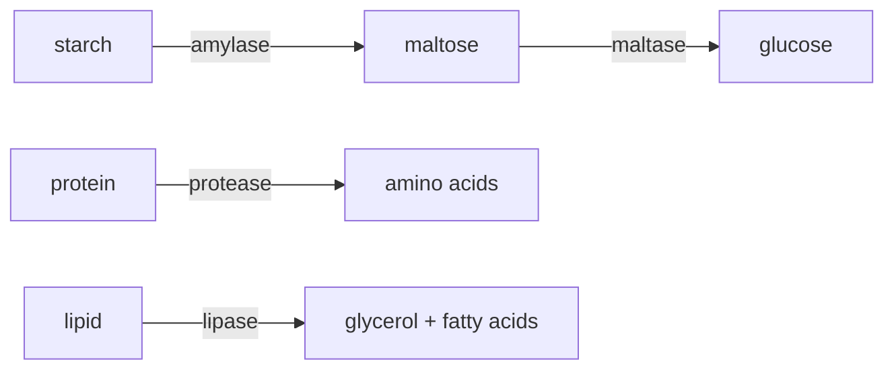

Proteins that function as biological catalysts

Speed up chemical reactions in the body
do not change themselves

The active site is complementary to the substrates

#### How enzyme works

Enzymes have active site.
The shape of the active site is complementary to its substrate.
Substrate fits into the active site of enzyme,
forming an enzyme-substrate complex.
Like lock & key.
Enzymes speed up the reaction by lowering the activation energy.

#### The lock and key mechanism

Enzymes are substrate-specific, only act open a particular kind of substrate

#### Enzyme activity

As temperature increases
kinetic energy of molecules increases
more frequent collision between enzymes and substrates
&rarr; more successful collision 

At higher temperature
&rarr; the active site of the enzyme changes shape
&rarr; enzyme is denatured
substrate no longer fits into the enzyme
no longer form enzyme-substrate complex

The optimum temperature depends own specific enzymes

Mutatis mutandis, as to pH