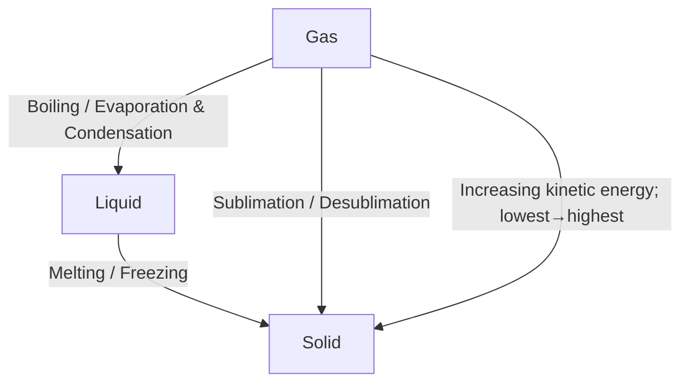

### A summarized differences (microscopic)

|             | Solid    | Liquid                | Gas                       |
| ----------- | -------- | --------------------- | ------------------------- |
| Arrangement | Regular  | Irregular             | Random                    |
| Motion      | Vibrate  | Slide past each other | Move randomly and rapidly |
| Separation  | Touching | Touching              | Far apart                 |

The energy supplied is to be absorbed to overcome the attraction between particles—bonding.

### Differences between boiling & evaporating

|             | Boiling                   | Evaporating                  |
| ----------- | ------------------------- | ---------------------------- |
| Rate        | High                      | Low                          |
| Temperature | At a specific temperature | Over a range of temperatures |
| Space       | Throughout the liquid     | A surface process            |

> Salts can reduce the freezing point and increase the boiling point of water.

### Kinetic particle theory

All substances are made up of particles.
Particles move constantly and randomly.

Pressure is the collision of moving particles against the container.

### Diffusion

| Macroscopic                                                        | Microscopic                                           |
| ------------------------------------------------------------------ | ----------------------------------------------------- |
| Movement of particles from high concentration to low concentration | The result of particles' constant and random movement |

Conclusion:

1. Temperature&uarr;, rate of diffusion&uarr;
2. Relative molecular mass&darr;, rate of diffusion&uarr;

### Two types of change in gas

__Temperature changes in gas__

&rarr; Influence on volume:

Temperature increases, particles have more energy&rarr;move faster.

Distance between particles increases&rarr;volume increases.

&rarr; Influence on pressure:

Temperature increases, particles have more energy&rarr;move faster.

They collide more often with container walls&rarr;pressure increases.

__Pressure change in gas__

Pressure increases, particles collide with container walls more frequently,
but the distance between gas particles are far apart and can be compressed.
&rarr; Volume increases.