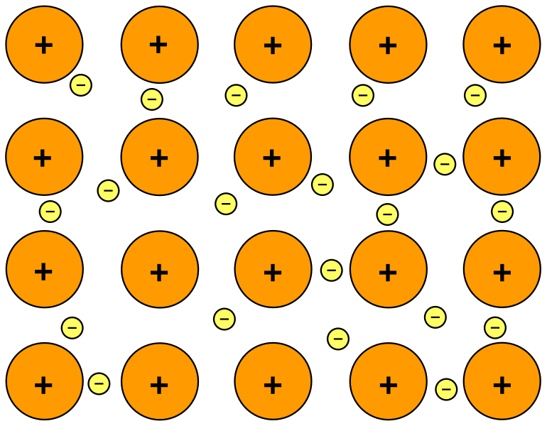

### TL;DR

| Ionic bond            | Covalent bond    | Metallic bond         |
| --------------------- | ---------------- | --------------------- |
| Electrons transferred | Electrons shared | Electrons delocalized |

### Ionic bond

__Definition:__

- A strong electrostatic attraction between oppositely charged ions.
- Formed between metal and non-metal elements

__ionic lattice (giant lattice structure of ionic compounds):__

- Regular arrangement
- Of alternating positive and negative ions / cations and anions.

__Properties:__

1. High melting and boiling points (usually solid at R.T.P)
	- Reason: strong electrostatic attraction between positive and negative ions
	- Which needs a large amount of energy to break
2. Conduct electricity when molten or in aqueous solution
	- There are mobile ions
3. Cannot conduct electricity when solid
	- There are no mobile ions or mobile electrons.
4. Usually soluble in water

### Metallic bond

__Definition:__

- A strong electrostatic attraction
- Between cations in a giant lattice
- And a 'sea' of delocalized electrons

__Properties:__

1. High melting and boiling points
	- Reason: strong electrostatic attraction between cations and delocalized electrons
	- Which needs a large amount of energy to break
2. Conduct electricity
	- Because there are mobile electrons
3. Malleability / easier to be shaped and ductility / made into wire
	- Because metal ions are arrange in layered structure
	- When a force is applied, the layers can slide

### Covalent bonds

__Definition:__

- Formed when a pair of electrons is shared between atoms,
- Leading to noble gas electronic configuration
- Formed between non-metal and non-metal

__Two types of structure:__

* Simple molecular structure (simple molecule)
* Giant covalent structure (macromolecule)

__Physical properties of simple molecules:__

1. Low melting and boiling points
	- Reason: weak intermolecular force between molecules
	- Which needs a small amount of energy to break
2. Cannot conduct electricity
	- Because there is no mobile ions or mobile/delocalized electrons
3. Usually insoluble in water

> Miscible &#x2194; immiscible