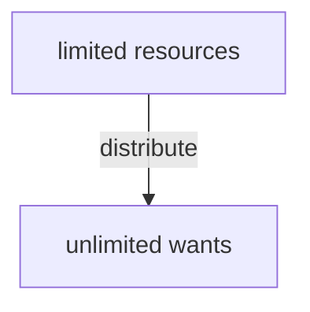

## What is economics?

Economics is a **social science** that studies how societies use **scarce resources** to *produce* valuable **goods** and **services**, and then *distribute* them among different people.

> It's about to optimize distributing **limited resources** to **unlimited wants**.

## Two branches of economics

### Microeconomics

**Definition:** a study of behaviors by individuals

1. the basic economic problem
2. allocation of resources
3. microeconomic decision makers

### Macroeconomics

**Definition:** a study of economy as a whole

1. government and macroeconomy
2. economic development
3. international trade and specialization

> Demand rises or supply falls &rarr; Price rises
> Indicator &rarr; living standards
> inflation &rarr; value falls