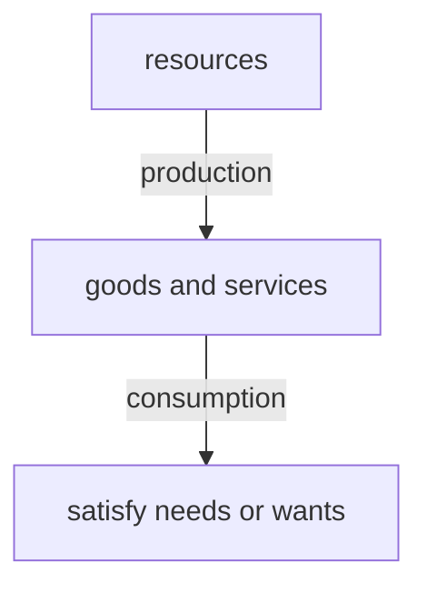
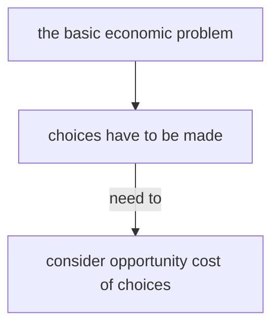

### 1.1 Nature of the problem

Resources are the inputs and to produce goods and services.

Resources are limited. Therefore G&S that can be produced are also limited.

#### Needs:

G&S that are essential for human survival, which is *limited*.

e.g. basic food, water, clothes, shelter etc.

#### Wants:

G&S that aren't essential for human survival, but for higher living standard, which is *unlimited*.

e.g. cell phone, snacks etc.

#### Basic economic problem -> Scarcity

**Limited/finite resources** *cannot satisfy* **unlimited/infinite wants**.

*Induction: Economic problem always exists and cannot be solved.*

Wants grow as the population grows.

Some non-renewable resources are being depleted. -> Wants always exceed resources.

#### Economic problem *affects* **all economic agents**.

| Economic agents | Resources                  | Wants                       |
| --------------- | -------------------------- | --------------------------- |
| Consumers       | limited income             | cannot buy all goods        |
| Workers         | limited skills & time      | cannot take all jobs        |
| Producers/firms | limited funds              | cannot produce all goods    |
| Government      | limited tax revenue/budget | cannot finance all projects |

**Purpose:** Study how to optimize allocation of limited resources to satisfy unlimited wants.

#### Three resource allocation decisions

1. *What* to produce
2. *How* to produce
3. *Whom* to produce for

### 1.2 Factors of production

#### 1.2.1 Definition of FOP

Resource used in production

* Land: What exists naturally on or under the land.
	* e.g. earth, animals, trees, oil etc.
* Labor: Human resources, including mental and physical efforts
	* e.g. teacher, doctor etc.
* Capital: Man-made goods used to produce other goods
	* e.g. machines, tools, teaching buildings etc.
* enterprise: Ability of key decision making and risk bearing in business and organizing other factors of production.
	* e.g. entrepreneur, CEO, owners of a firm

> Money *isn't* any types of FOP

**Factor rewards:** Payments required to obtain each FOP.

| FOP        | reward   |
| ---------- | -------- |
| land       | rent     |
| labor      | wage     |
| capital    | interest |
| enterprise | profit   |

*BTW:*
$$
revenue - cost = profit
$$

#### 1.2.2 Quantity and quality of FOPs

1. Causes for the change of land
	* Rise in quantity of land
		1. discover new fuels, e.g. petroleum
		2. reclamation—create land from sea
		3. plant trees—prevent soil erosion
	* Rise in quality of land
		* good weather, e.g. less drought raises output
2. Causes for the change of labors
	* Rise in quantity of labor
		1. immigration—increase population size
		2. increase retirement age
		3. decrease school-leaving age
		4. increase birth rate
	* Rise in quality of labor
		1. education & training—become skilled labors
		2. use equipment—higher labor productivity, higher output per labor per period
3. Causes for the change of enterprise
    * Rise in quantity of enterprise
        1. less tax on firms, which leads to higher profit, which encourages people to start a business
        2. less government regulation, which makes it easier to set up firms
    * Rise in quality of enterprise
        * education & training, which helps developing skills for business management
4. Causes for the change of capital
    * Rise in quantity of capital
        * use robots to replace workers
    * Rise in quality of capital
        * advanced technology, which makes capital productivity higher

> Capital productivity means **output per capital per period**.
> etc. etc.

#### An Summary

| Factors of Production | Definition                                                                                | Examples          | Reward   | Increase Quantity     | Increase Quality    |
| --------------------- | ----------------------------------------------------------------------------------------- | ----------------- | -------- | --------------------- | ------------------- |
| Land                  | natural resources                                                                         | trees, oil        | rent     | plant tree            | fertilizer          |
| Labor                 | human resources, including mental and physical efforts                                    | teachers, doctors | wages    | immigration           | education           |
| Capital               | man-made goods used to produce other goods                                                | machines, tools   | interest | robots replace labors | advanced technology |
| Enterprise            | ability of risk bearing and key decision making and organizing other factor of production | entrepreneur, CEO | profit   | less tax on firms     | education           |

### 1.3 Opportunity cost

**Definition:** the next best choice (or alternative) that is forgone (or given up).

#### Influences of opportunity cost on decision making of economic agents

| Economic Agent | Restricted Resources  | Example                                                                       |
| -------------- | --------------------- | ----------------------------------------------------------------------------- |
| Consumers      | have limited income   | if they buy more good A, then they cannot buy more good B                     |
| Producers      | limited funds         | if they produce more good A, then they cannot produce more good B             |
| Workers        | limited skills & time | if they choose to work longer, then they will have less leisure time.         |
| Governments    | limited tax revenue   | If they spend more on school, then they'd spend less on other infrastructure. |

> Opportunity cost *IS NOT* production cost.

#### Classify goods & services by opportunity cost

* Economic goods
	* goods which require resources to produce
	* limited in supply
	* have opportunity
	* e.g. clothes
* Free goods
	* need not to be made by scarce resources
	* unlimited in supply
	*  no opportunity cost
	* e.g. air and sunshine

#### Two types of economic goods

| Capital Goods                               | Consumer Goods                                |
| ------------------------------------------- | --------------------------------------------- |
| to produce other goods and services         | to satisfy needs and wants                    |
| e.g. engine                                 | e.g. car                                      |
| needed by producers                         | needed by consumers                           |
| the purchase of capital goods is investment | the purchase of consumer goods is consumption |

### 1.4 Production possibility curve

#### An example

* factors that determine the maximum output of a fridge factory
	1. the quality & quantity of FOPs
	2. the state of technology

#### Definition

Production possibility curve is a curve of **maximum output combination** of *two goods and services* that can be produced with **existing/given resources and technology** (constant quality & quantity of FOPs) being *fully and efficiently* used.

> Production possibility curve can be used for the output for both *firm and economy*.

#### 1.4.1 Shift of PPC

##### Right shift of PPC

**Reason:**

* rise in quantity of FOPs, e.g. immigration of labors
* rise in quality of FOPs, e.g. training of labors
* advanced technology raises the quality of capital

**Result:**

* increase the maximum output / productive capacity / productive potential
* which leads to economic growth

> consumption, which is about the present
> investment, which is about the future

##### Left shift of PPC

**Reason:**

* fall in quantity of FOPs, e.g. emigration of labors
* fall in quality of FOPs, e.g. disaster destroy capitals

**Result:**

* decrease the maximum output
* which leads to recession (or negative economic growth)

##### Right shift that happens only in one axis

**Reason:**

* rise in quantity of only one factor

**Result:**

* rise in the maximum output of only one given factor

##### An example

**Problem:** Analyze using a PPC diagram, what effect of higher death rate is likely to have on an economy.

**Reason: (change in FOP or tech)**

* higher death rate reduces the quantity of labor

**Result: (change in output)**

* Maximum output of the goods falls.

#### 1.4.2 Points move along PPC

e.g. Opportunity cost of producing 100 extra consumer goods is 60 capital goods given up.

**Reason:**

* Reallocate resource to increase the output of a good

**Result:**

* indicate different **output combination**

> More of one good can be produced only if less of the other good is made.
> Only movements that are made along the line create opportunity cost (because obviously, you have to make less good B to produce more good A).

#### The shape of the PPC

1. Convex curve from the origin (or bow outward), which indicates rising opportunity cost.
	* Since one first uses the most suitable resource, which makes it require less efforts to change location or tasks, which leads to low opportunity cost.
	* Then one uses the less suitable resource, which requires more efforts, leading to higher opportunity cost.

2. Straight line
	* which indicates constant opportunity cost

#### 1.4.3 Points move inward and outward with PPC

| Location/Movement of Points | Reason                                  | Result                              |
| --------------------------- | --------------------------------------- | ----------------------------------- |
| on the PPC                  | fully employment of resource            | output is maximum                   |
| outside the PPC             | resource is limited                     | output is currently unattainable    |
| inside the PPC              | there is unemployment                   | output is below maximum             |
| move inward                 | unemployment rises                      | total output falls                  |
| move outward                | unemployment falls (to full employment) | total output rises (to the maximum) |
