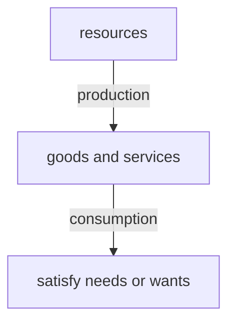

Resources are the inputs used to produce goods and services.

Resources are limited. Therefore G&S that can be produced are also limited.

### Needs:

G&S that are essential for human survival, which is *limited*.

e.g. basic food, water, clothes, shelter etc.

### Wants:

G&S that aren't essential for human survival, but for higher living standard, which is *unlimited*.

e.g. cell phone, snacks etc.

### Basic economic problem &rarr; Scarcity

**Limited/finite resources** *cannot satisfy* **unlimited/infinite wants**.

*Induction: Economic problem always exists and cannot be solved.*

Wants grow as the population grows.

Some non-renewable resources are being depleted. &rarr; Wants always exceed resources.

### Economic problem *affects* **all economic agents**.

| Economic agents | Resources                  | Wants                       |
| --------------- | -------------------------- | --------------------------- |
| Consumers       | limited income             | cannot buy all goods        |
| Workers         | limited skills & time      | cannot take all jobs        |
| Producers/firms | limited funds              | cannot produce all goods    |
| Government      | limited tax revenue/budget | cannot finance all projects |

**Purpose:** Study how to optimize allocation of limited resources to satisfy unlimited wants.

### Three resource allocation decisions

1. *What* to produce
2. *How* to produce
3. *Whom* to produce for
