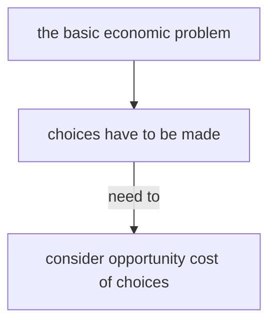

**Definition:** the next best choice (or alternative) that is forgone (or given up).

### Influences of opportunity cost on decision making of economic agents

| Economic Agent | Restricted Resources  | Example                                                                       |
| -------------- | --------------------- | ----------------------------------------------------------------------------- |
| Consumers      | have limited income   | if they buy more good A, then they cannot buy more good B                     |
| Producers      | limited funds         | if they produce more good A, then they cannot produce more good B             |
| Workers        | limited skills & time | if they choose to work longer, then they will have less leisure time.         |
| Governments    | limited tax revenue   | if they spend more on school, then they'd spend less on other infrastructure. |

> Opportunity cost *IS NOT* production cost.

### Classify goods & services by opportunity cost

* Economic goods
	* goods which require resources to produce
	* limited in supply
	* have opportunity cost
	* e.g. clothes
* Free goods
	* need not be made by scarce resources
	* unlimited in supply
	* no opportunity cost
	* e.g. air and sunshine

### Two types of economic goods

| Capital Goods                               | Consumer Goods                                |
| ------------------------------------------- | --------------------------------------------- |
| to produce other goods and services         | to satisfy needs and wants                    |
| e.g. engine                                 | e.g. car                                      |
| needed by producers                         | needed by consumers                           |
| the purchase of capital goods is investment | the purchase of consumer goods is consumption |
