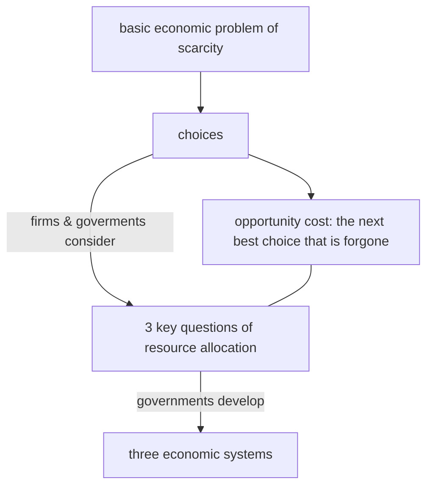
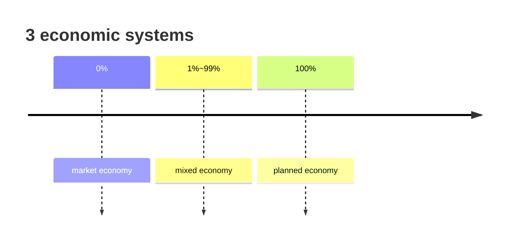

In an economy:

Private sectors aim for private interest, e.g. maximum profit.

1. private firms
2. individuals

Public sectors aim for improving social welfare.

1. public firms
2. government

### Three economic systems

| Economic system | Resource allocation | Government intervention  |
| --------------- | ------------------- | ------------------------ |
| planned         | by government       | 100% / no private sector |
| market          | by market           | 0% / no public sector    |
| mixed           | both                | 1% to 99%                |

### Market

Market is a system that brings all producers and all consumers of a good or service together to trade.