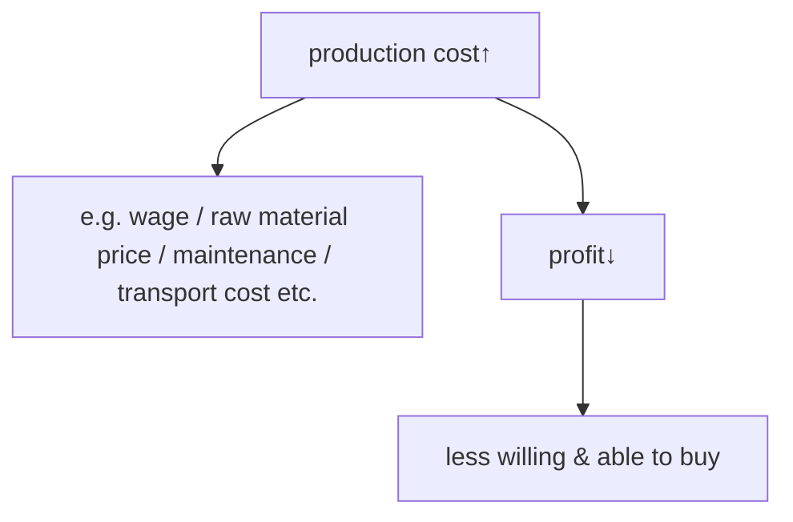
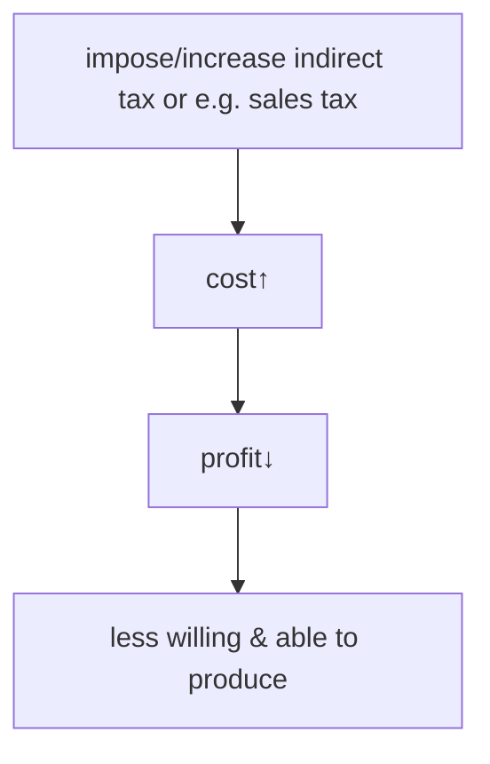
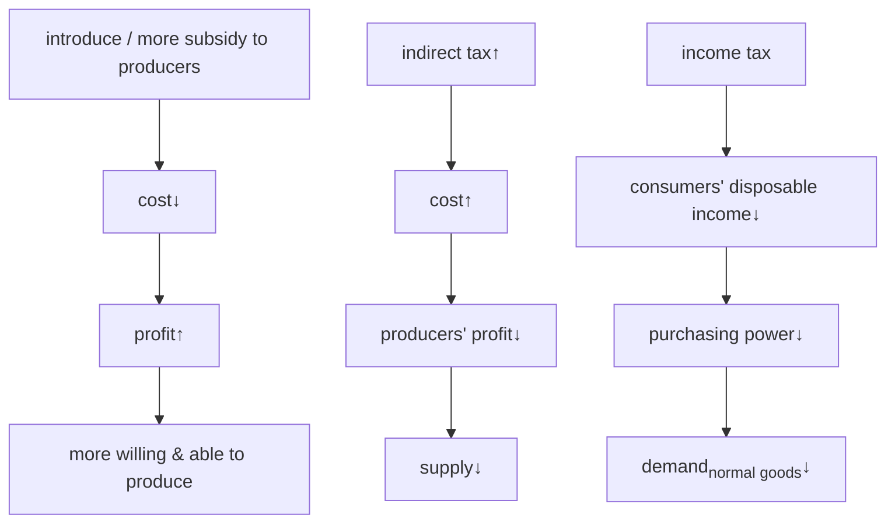
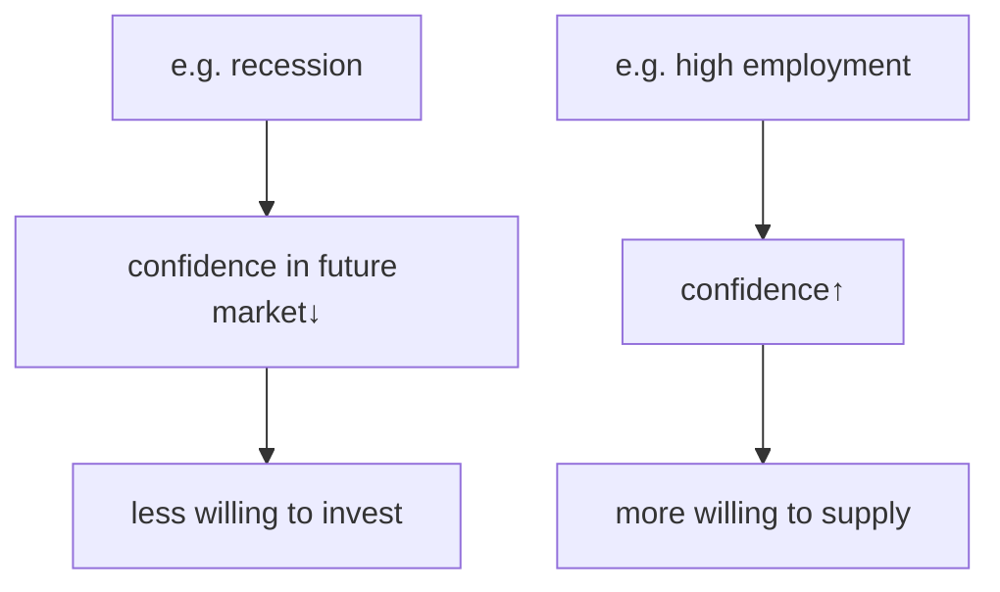
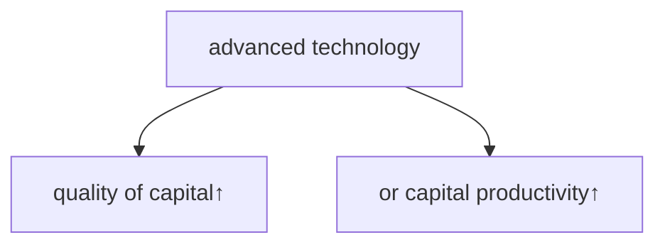
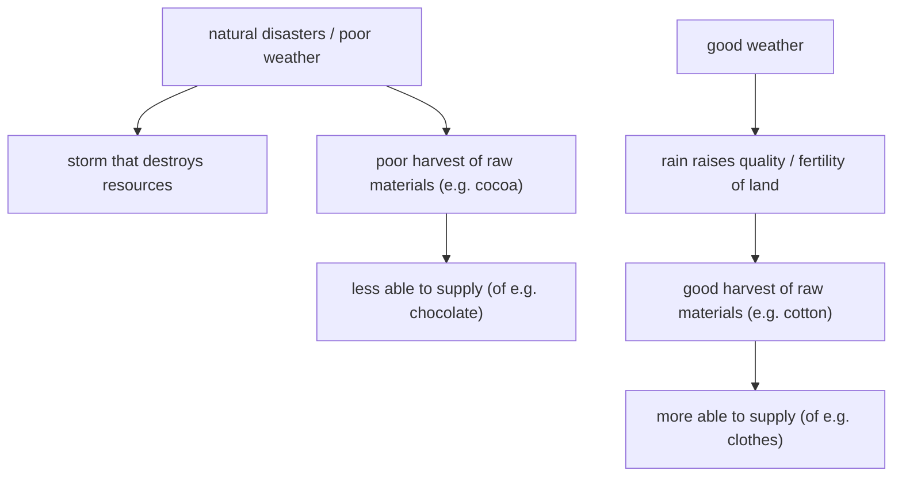

Supply is the willingness and ability to sell a product in a given period.

### Supply curve

Supply curve demonstrates a positive relation between quantity supplied and price.

> Supply curve is usually a upward sloping curve.

### Individual supply

Individual supply is the amount that a single firm is willing and able to supply at different prices.

### Market supply

Market supply is the sum of all individual supply at different prices.

### Movement along the supply curve

**Reason:** Due to the change of price of the good.

| Type                  | Reason                                           | Result                                   |
| --------------------- | ------------------------------------------------ | ---------------------------------------- |
| extension in supply   | rise in price causes a rise in quantity supplied | upward movement along the supply curve   |
| contraction in supply | fall in price causes a fall in quantity supplied | downward movement along the supply curve |

### Shift of the supply curve

**Reason:** Due to a change in the non-price factor(s).

| Type        | Reason                                                  | Result                                |
| ----------- | ------------------------------------------------------- | ------------------------------------- |
| right shift | more quantity supplied at each price / a rise in supply | a rightward shift of the supply curve |
| left shift  | less quantity supplied at each price / a fall in supply | a leftward shift of the supply curve  |

### Differences between an extension in supply and a rise in supply

| Difference           | Figure                             | Reason              | Result                                                   |
| -------------------- | ---------------------------------- | ------------------- | -------------------------------------------------------- |
| exntension in supply | point moves along the supply curve | rise in price       | rise in quantity supplied at a price                     |
| rise in supply       | the supply curve shifts right      | non-price factor(s) | rise in quantity supplied at each price / rise in supply |

### Non-price factors for shift of supply curve

#### Production cost

> Profit = Revenue - Cost

#### Indirect tax

#### Subsidy

#### Business confidence

#### Advanced (or inefficient) technology

#### Weather (or natural disaster) for agricultural goods

