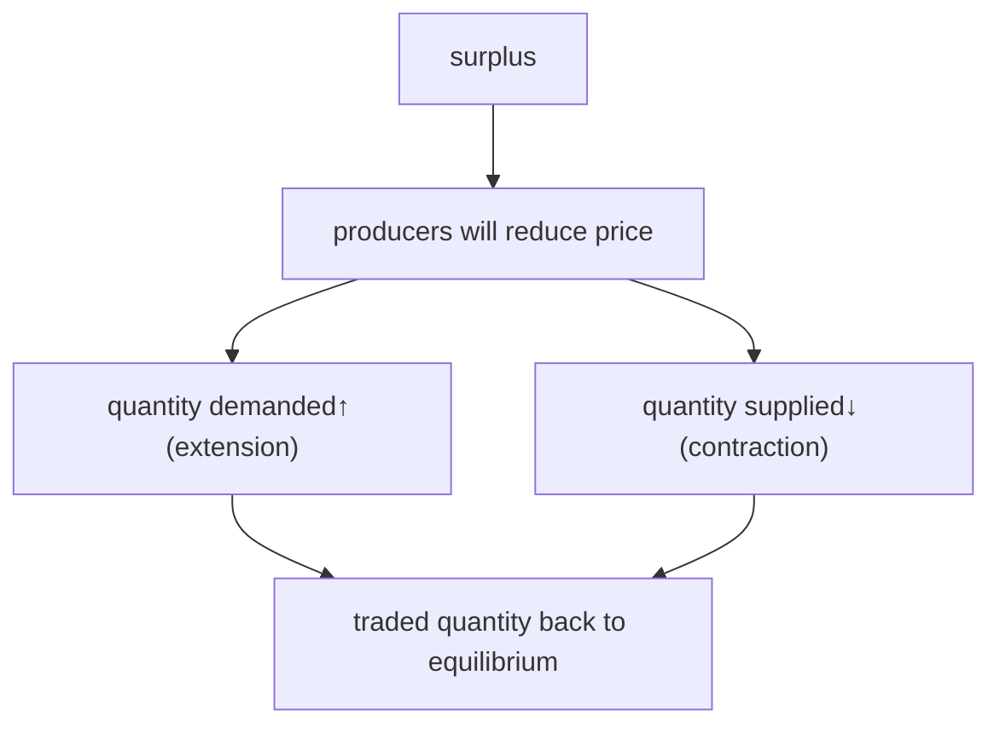
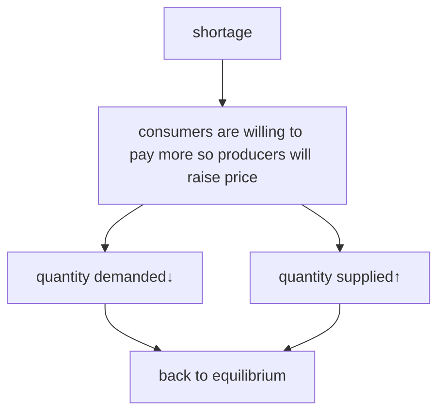

> Consumers: want lower prices
> Producers: want higher prices

A price *rise* is due to demand&uarr; or supply&darr;.
A price *fall* is due to demand&darr; or supply&uarr;.

**The reasons why price changes are non-price factors of demand and supply, not surplus and shortage.**

### Market equilibrium

Where market demand and market supply are equal and the market clears, so there is no pressure to change price.

1. Quantity demanded and quantity supplied in demand/supply schedule
2. Intersection in demand/supply diagram

### Market disequilibrium

Where market demand and supply are not equal.
E.g. shortage or surplus.

#### Surplus

Excess in supply, quantity supplied &gt; quantity demanded.

**Reason:** Price rises above equilibrium &rarr; quantity supplied &gt; quantity demanded &rarr; surplus.

**Result:**

#### Shortage

Excess demand, quantity supplied &lt; quantity demanded.

**Reason:** Price falls below equilibrium &rarr; quantity supplied &lt; quantity demanded &rarr; shortage.

**Result:**

